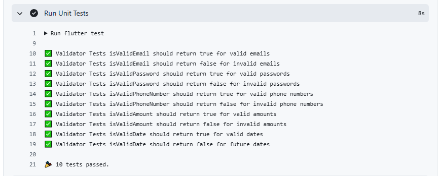
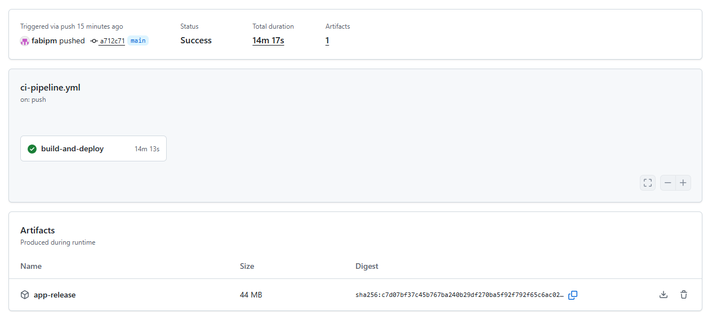

# VanguardMoney - Examen CI/CD


## 📋 Datos del Alumno

- **Nombre:** Fabiola Estefani Poma Machicado
- **Tecnología:** Flutter
- **Proyecto:** Sistema de gestión financiera con Pipeline CI/CD

## 🔗 Repositorio

**GitHub:** https://github.com/fabipm/SM2_Examen_CICD

## 🚀 Pipeline CI/CD

Este proyecto implementa un flujo completo de Integración y Entrega Continua (CI/CD) usando GitHub Actions que incluye:

### Etapas del Pipeline

1. ✅ **Checkout Code** - Descarga del código fuente
2. ✅ **Setup Flutter & Java** - Configuración del entorno de desarrollo
3. ✅ **Install Dependencies** - Instalación de dependencias (`flutter pub get`)
4. ✅ **Code Quality Check** - Análisis de calidad del código (`flutter analyze`)
5. ✅ **Run Unit Tests** - Ejecución de pruebas unitarias (5 tests)
6. ✅ **Build Application** - Construcción del APK de Android
7. ✅ **Upload Artifact** - Publicación del APK generado

## 🧪 Pruebas Unitarias

El proyecto incluye **5 funciones de validación** con sus respectivas pruebas unitarias:

### Clase `Validator` (`lib/core/utils/validator.dart`)

1. **`isValidEmail(String email)`** - Valida formato de correo electrónico
2. **`isValidPassword(String password)`** - Valida contraseñas seguras (min. 8 caracteres, mayúscula, minúscula y número)
3. **`isValidPhoneNumber(String phone)`** - Valida números telefónicos (8-15 dígitos)
4. **`isValidAmount(double amount)`** - Valida montos de transacciones (0 < monto ≤ 1,000,000)
5. **`isValidDate(DateTime date)`** - Valida fechas (no permite fechas futuras)

### Archivo de Tests (`test/validator_test.dart`)

Contiene **10 casos de prueba** que cubren escenarios positivos y negativos para cada función de validación.

## 📸 Evidencias

### 1. Tests Unitarios Pasando

*[INSTRUCCIONES: Agrega aquí la captura de pantalla del log "Run Unit Tests" de GitHub Actions mostrando "All tests passed!"]*



### 2. Artefacto Generado (APK)

*[INSTRUCCIONES: Agrega aquí la captura de pantalla de la sección "Artifacts" al final de la ejecución del workflow, mostrando el archivo app-release.apk]*



## 🛠️ Tecnologías Utilizadas

- **Flutter** 3.27+ (Dart 3.6.0+)
- **GitHub Actions** - Automatización CI/CD
- **Android SDK** - Compilación de APK
- **Java 17** - Build tools para Android

## 📦 Cómo Descargar el APK

1. Ve a la pestaña **Actions** en GitHub
2. Selecciona la última ejecución exitosa del workflow
3. Desplázate hasta el final de la página
4. En la sección **Artifacts**, descarga `app-release`
5. Descomprime el archivo ZIP y obtén el APK

## 🔄 Ejecución Local

### Requisitos Previos
- Flutter 3.27+ instalado
- Android SDK configurado
- Java JDK 17+

### Comandos

```bash
# Instalar dependencias
flutter pub get

# Ejecutar análisis de código
flutter analyze

# Ejecutar tests unitarios
flutter test

# Construir APK
flutter build apk --release
```

## 📝 Estructura del Proyecto

```
lib/
├── core/
│   └── utils/
│       └── validator.dart        # Funciones de validación
├── features/                     # Módulos de la aplicación
└── main.dart                     # Punto de entrada

test/
└── validator_test.dart           # Tests unitarios

.github/
└── workflows/
    └── ci-pipeline.yml           # Configuración del pipeline CI/CD
```

## ✅ Estado del Pipeline

El badge al inicio de este README muestra el estado actual del pipeline. Un badge verde indica que todas las pruebas y el build pasaron correctamente.

---
